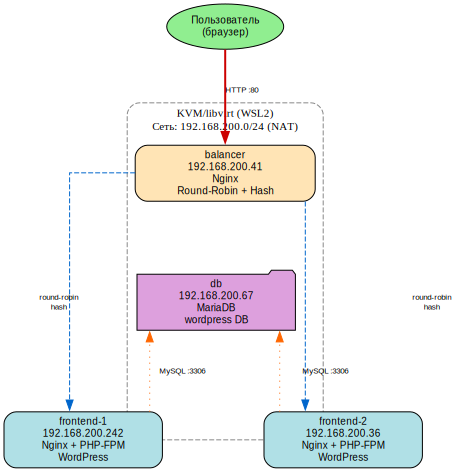

# Домашнее задание: Балансировка веб-приложения

## Цель

Настроить Nginx в качестве балансировщика с двумя методами (round-robin и hash), два фронтенд-сервера с WordPress и общую базу данных MariaDB.

## Архитектура


text

## Компоненты

| ВМ | IP | Роль | ПО |
|----|-----|------|-----|
| balancer | 192.168.200.41 | Балансировщик | Nginx |
| frontend-1 | 192.168.200.242 | Фронтенд | Nginx + PHP-FPM + WordPress |
| frontend-2 | 192.168.200.36 | Фронтенд | Nginx + PHP-FPM + WordPress |
| db | 192.168.200.67 | База данных | MariaDB |

## Методы балансировки

### Round-robin

Запросы распределяются по очереди:
Запрос 1 → frontend-2
Запрос 2 → frontend-1
Запрос 3 → frontend-2
Запрос 4 → frontend-1

text

### Hash

Одинаковые URI всегда попадают на один сервер:
/alpha → всегда frontend-2
/beta → всегда frontend-2
/gamma → всегда frontend-1

text

## Результаты тестирования

| Метод | Результат |
|-------|-----------|
| Round-robin | Запросы чередуются: 1→2→1→2→1→2 |
| Hash `/alpha` | Всегда `frontend-2` |
| Hash `/beta` | Всегда `frontend-2` |
| Hash `/gamma` | Всегда `frontend-1` |
| WordPress | HTTP 302 → `/wp-admin/install.php` |

## Структура проекта
balancer-project/
├── main.tf # Terraform: сеть, 4 ВМ, диски
├── outputs.tf # Выходные параметры
├── cloud-init.yaml # Cloud-init: пользователи, SSH
├── architecture.dot # Graphviz-схема
├── ansible/
│ ├── inventory.yml # Инвентарь узлов
│ ├── playbook.yml # Основной плейбук настройки
│ └── playbook_headers.yml # Добавление заголовка X-Backend-Server
├── screenshots/ # Скриншоты
└── README.md # Документация

text

## Инструкция по воспроизведению

```bash
# 1. Клонировать репозиторий
git clone <url>
cd balancer-project

# 2. Создать инфраструктуру
terraform init
terraform import libvirt_pool.default <UUID>
terraform apply -auto-approve

# 3. Настроить ВМ
cd ansible
ansible-playbook -i inventory.yml playbook.yml

# 4. Проверить балансировку
curl -sI http://192.168.200.41/roundrobin | grep X-Backend-Server
